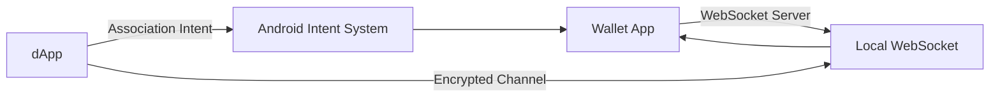

# Mobile Wallet Adapter Protocol Deep Dive

Technical guide to understanding how Mobile Wallet Adapter works under the hood.

## Protocol Overview

Mobile Wallet Adapter (MWA) 2.0 is a secure inter-app communication protocol that enables dApps to request signing services from mobile wallet apps. Unlike web wallets that share browser context, mobile wallets run in isolated apps requiring a sophisticated protocol for secure communication.

## Architecture Components



### Key Components

1. **Association Intent** - Android's inter-app communication
2. **WebSocket Server** - Local communication channel
3. **ECDH Key Exchange** - Establishes shared encryption key
4. **AES-GCM Encryption** - Secures all messages
5. **JSON-RPC Protocol** - Message format and method calls

## Session Lifecycle

### 1. Association Phase

When dApp calls `transact()`:

```typescript
// This triggers the association process
await transact(async (wallet) => {
  // Session operations
});
```

**Under the hood:**

1. **Generate Association URI**
   ```
   solana-wallet://v1/associate/local?association=base64EncodedData
   ```

2. **Launch Wallet App**
   - Android intent system opens wallet app
   - Wallet app becomes foreground

3. **Parse Association Data**
   ```json
   {
     "port": 42069,
     "session": "ephemeral_session_id",
     "public_key": "dapp_ephemeral_public_key"
   }
   ```

### 2. WebSocket Connection

**Wallet App (Server Side):**
```kotlin
// Wallet starts WebSocket server
val server = WebSocketServer(port)
server.start()
```

**dApp (Client Side):**
```typescript
// dApp connects to wallet's WebSocket
const ws = new WebSocket(`ws://localhost:${port}`);
```

### 3. Cryptographic Handshake

**ECDH Key Exchange:**

1. **dApp generates ephemeral keypair**
   ```typescript
   const dappKeyPair = nacl.box.keyPair();
   ```

2. **Wallet generates ephemeral keypair**
   ```kotlin
   val walletKeyPair = Curve25519.generateKeyPair()
   ```

3. **Exchange public keys**
   ```json
   // dApp → Wallet
   {
     "jsonrpc": "2.0",
     "method": "hello",
     "params": {
       "dapp_public_key": "base64_public_key"
     }
   }
   ```

4. **Derive shared secret**
   ```typescript
   const sharedSecret = nacl.box.before(walletPublicKey, dappSecretKey);
   ```

**Both sides now have the same shared encryption key**

### 4. Encrypted Communication

All subsequent messages are encrypted with AES-GCM:

```typescript
// Encryption function
const encrypt = (message: string, sharedSecret: Uint8Array): EncryptedMessage => {
  const nonce = nacl.randomBytes(12);
  const encrypted = nacl.secretbox(
    new TextEncoder().encode(message),
    nonce,
    sharedSecret
  );
  
  return {
    encrypted: base64.encode(encrypted),
    nonce: base64.encode(nonce)
  };
};
```

## JSON-RPC Methods

### authorize

**Request:**
```json
{
  "jsonrpc": "2.0",
  "id": 1,
  "method": "authorize",
  "params": {
    "identity": {
      "name": "MyDApp",
      "uri": "https://mydapp.com", 
      "icon": "favicon.ico"
    },
    "chain": "solana:devnet",
    "auth_token": "optional_cached_token"
  }
}
```

**Response:**
```json
{
  "jsonrpc": "2.0",
  "id": 1,
  "result": {
    "accounts": [
      {
        "address": "base64_encoded_pubkey",
        "label": "Main Account"
      }
    ],
    "auth_token": "opaque_token_string",
    "wallet_uri_base": "solana-wallet://v1"
  }
}
```

### signAndSendTransactions

**Request:**
```json
{
  "jsonrpc": "2.0", 
  "id": 2,
  "method": "signAndSendTransactions",
  "params": {
    "transactions": [
      {
        "transaction": "base64_encoded_transaction"
      }
    ]
  }
}
```

**Response:**
```json
{
  "jsonrpc": "2.0",
  "id": 2,
  "result": {
    "signatures": ["base58_signature"]
  }
}
```

### signTransactions

**Request:**
```json
{
  "jsonrpc": "2.0",
  "id": 3,
  "method": "signTransactions", 
  "params": {
    "transactions": [
      {
        "transaction": "base64_encoded_transaction"
      }
    ]
  }
}
```

**Response:**
```json
{
  "jsonrpc": "2.0",
  "id": 3,
  "result": {
    "signed_transactions": ["base64_signed_transaction"]
  }
}
```

### signMessages

**Request:**
```json
{
  "jsonrpc": "2.0",
  "id": 4,
  "method": "signMessages",
  "params": {
    "addresses": ["base64_address"],
    "payloads": ["base64_message"]
  }
}
```

**Response:**
```json
{
  "jsonrpc": "2.0", 
  "id": 4,
  "result": {
    "signed_payloads": ["base64_signature"]
  }
}
```

### deauthorize

**Request:**
```json
{
  "jsonrpc": "2.0",
  "id": 5,
  "method": "deauthorize",
  "params": {
    "auth_token": "token_to_invalidate"
  }
}
```

**Response:**
```json
{
  "jsonrpc": "2.0",
  "id": 5,
  "result": {}
}
```

## Security Model

### Identity Verification

**App Identity Cryptographic Verification (Android):**

1. **dApp declares identity in authorize request**
2. **Wallet extracts app signing certificate**
3. **Wallet verifies certificate matches declared URI**
4. **Prevents identity spoofing attacks**

```kotlin
// Wallet-side verification
val packageInfo = packageManager.getPackageInfo(
    callingPackage, 
    PackageManager.GET_SIGNATURES
)

val cert = packageInfo.signatures[0].toByteArray()
val verified = verifyIdentityMatchesCertificate(declaredIdentity, cert)
```

### Encryption Details

**Algorithm:** AES-256-GCM with Curve25519 ECDH
**Key Derivation:** HKDF-SHA256
**Nonce:** 96-bit random per message

```typescript
// Detailed encryption implementation
class SecureChannel {
  private sharedSecret: Uint8Array;
  
  constructor(dappSecretKey: Uint8Array, walletPublicKey: Uint8Array) {
    // ECDH to derive shared secret
    this.sharedSecret = nacl.box.before(walletPublicKey, dappSecretKey);
  }
  
  encrypt(plaintext: string): EncryptedMessage {
    const nonce = nacl.randomBytes(12);
    const key = this.deriveKey(nonce);
    
    const cipher = crypto.createCipherGCM('aes-256-gcm');
    cipher.setAAD(nonce);
    
    let encrypted = cipher.update(plaintext, 'utf8', 'base64');
    encrypted += cipher.final('base64');
    
    const tag = cipher.getAuthTag();
    
    return {
      encrypted,
      nonce: base64.encode(nonce),
      tag: base64.encode(tag)
    };
  }
  
  private deriveKey(nonce: Uint8Array): Uint8Array {
    return hkdf(this.sharedSecret, 32, nonce);
  }
}
```

## Error Handling

### Standard JSON-RPC Errors

```json
{
  "jsonrpc": "2.0",
  "id": 1,
  "error": {
    "code": -32603,
    "message": "User declined authorization",
    "data": {
      "details": "User pressed cancel button"
    }
  }
}
```

### Common Error Codes

| Code | Message | Description |
|------|---------|-------------|
| -32700 | Parse error | Invalid JSON |
| -32600 | Invalid Request | Missing required fields |
| -32601 | Method not found | Unsupported method |
| -32602 | Invalid params | Wrong parameter types |
| -32603 | Internal error | Wallet-side error |
| -1 | User declined | User rejected request |
| -2 | Too many requests | Rate limiting |
| -3 | Unauthorized | No valid auth token |

### Error Handling in dApp

```typescript
const handleMWAError = (error: any) => {
  if (error.code) {
    switch (error.code) {
      case -1:
        return 'User declined the request';
      case -2:
        return 'Too many requests. Please wait.';
      case -3:
        return 'Session expired. Please reconnect.';
      case -32601:
        return 'Wallet does not support this operation';
      default:
        return `Wallet error: ${error.message}`;
    }
  }
  return 'Unknown error occurred';
};
```

## Session Management

### Auth Token Lifecycle

```typescript
class MWASessionManager {
  private authToken: string | null = null;
  
  async authorize(): Promise<AuthResult> {
    return await transact(async (wallet) => {
      const result = await wallet.authorize({
        identity: APP_IDENTITY,
        chain: 'solana:devnet',
        auth_token: this.authToken || undefined,
      });
      
      // Store token for future sessions
      this.authToken = result.auth_token;
      await AsyncStorage.setItem('mwa_auth_token', this.authToken);
      
      return result;
    });
  }
  
  async deauthorize(): Promise<void> {
    if (!this.authToken) return;
    
    await transact(async (wallet) => {
      await wallet.deauthorize({
        auth_token: this.authToken!,
      });
    });
    
    this.authToken = null;
    await AsyncStorage.removeItem('mwa_auth_token');
  }
  
  async loadStoredToken(): Promise<void> {
    this.authToken = await AsyncStorage.getItem('mwa_auth_token');
  }
}
```

### Session State Tracking

```typescript
enum SessionState {
  IDLE = 'idle',
  CONNECTING = 'connecting',  
  AUTHORIZING = 'authorizing',
  AUTHORIZED = 'authorized',
  SIGNING = 'signing',
  ERROR = 'error'
}

class SessionTracker {
  private state = SessionState.IDLE;
  private listeners: ((state: SessionState) => void)[] = [];
  
  setState(newState: SessionState) {
    this.state = newState;
    this.listeners.forEach(listener => listener(newState));
  }
  
  onStateChange(callback: (state: SessionState) => void) {
    this.listeners.push(callback);
    return () => {
      this.listeners = this.listeners.filter(l => l !== callback);
    };
  }
}
```

## Performance Considerations

### Connection Pooling

```typescript
// Avoid creating multiple simultaneous sessions
class MWAConnectionPool {
  private activeSession: Promise<any> | null = null;
  
  async execute<T>(operation: (wallet: Web3MobileWallet) => Promise<T>): Promise<T> {
    // Wait for any existing session to complete
    if (this.activeSession) {
      await this.activeSession;
    }
    
    this.activeSession = transact(operation);
    
    try {
      return await this.activeSession;
    } finally {
      this.activeSession = null;
    }
  }
}
```

### Message Batching

```typescript
// Batch multiple operations in single session
const batchOperations = async () => {
  return await transact(async (wallet) => {
    // Single authorization for multiple operations
    const { accounts } = await wallet.authorize({
      identity: APP_IDENTITY,
      chain: 'solana:devnet',
    });
    
    // Multiple signatures in one session
    const results = await Promise.all([
      wallet.signTransactions({ transactions: [tx1, tx2] }),
      wallet.signMessages({ 
        addresses: [accounts[0].address],
        payloads: [message1, message2]
      })
    ]);
    
    return results;
  });
};
```

## Protocol Versions

### MWA 2.0 Features

- **Sign in with Solana (SIWS)** support
- **Improved error handling** with detailed error codes
- **Better session management** with auth tokens
- **Enhanced security** with identity verification

### Backward Compatibility

```typescript
// Check wallet MWA version support
const checkWalletCapabilities = async () => {
  try {
    await transact(async (wallet) => {
      // Try MWA 2.0 feature
      await wallet.authorize({
        identity: APP_IDENTITY,
        chain: 'solana:devnet',
        sign_in_payload: { /* SIWS payload */ }
      });
    });
    return '2.0';
  } catch (error) {
    if (error.message.includes('Method not found')) {
      return '1.0';
    }
    throw error;
  }
};
```

## Debugging Tools

### Protocol Inspector

```typescript
// Log all MWA protocol messages
const debugTransact = async (callback: any) => {
  return await transact(async (wallet) => {
    const originalSend = wallet.send;
    
    wallet.send = function(message) {
      console.log('MWA Request:', JSON.stringify(message, null, 2));
      
      const result = originalSend.apply(this, arguments);
      
      result.then((response: any) => {
        console.log('MWA Response:', JSON.stringify(response, null, 2));
      });
      
      return result;
    };
    
    return await callback(wallet);
  });
};
```

### Session Diagnostics

```typescript
const diagnosticInfo = {
  protocolVersion: '2.0',
  lastSessionDuration: 0,
  errorCount: 0,
  successfulOperations: 0,
};

const trackSessionMetrics = () => {
  const startTime = Date.now();
  
  return {
    onSuccess: () => {
      diagnosticInfo.successfulOperations++;
      diagnosticInfo.lastSessionDuration = Date.now() - startTime;
    },
    onError: () => {
      diagnosticInfo.errorCount++;
    }
  };
};
```

## Integration Best Practices

### 1. Always Handle Disconnections

```typescript
const robustTransact = async (operation: any, maxRetries = 3) => {
  for (let attempt = 1; attempt <= maxRetries; attempt++) {
    try {
      return await transact(operation);
    } catch (error) {
      if (attempt === maxRetries) throw error;
      
      // Wait before retry with exponential backoff
      await new Promise(resolve => 
        setTimeout(resolve, 1000 * Math.pow(2, attempt - 1))
      );
    }
  }
};
```

### 2. Validate All Parameters

```typescript
const validateTransaction = (transaction: VersionedTransaction): boolean => {
  try {
    // Validate transaction structure
    if (!transaction.message || !transaction.signatures) {
      return false;
    }
    
    // Validate addresses
    transaction.message.staticAccountKeys.forEach(key => {
      new PublicKey(key); // Throws if invalid
    });
    
    return true;
  } catch {
    return false;
  }
};
```

### 3. Implement Proper UX

```typescript
const userFriendlyTransact = async (operation: any) => {
  const showProgress = () => {
    Alert.alert('Connecting...', 'Opening wallet app');
  };
  
  const hideProgress = () => {
    // Hide loading indicator
  };
  
  try {
    showProgress();
    return await transact(operation);
  } catch (error) {
    Alert.alert('Error', handleMWAError(error));
    throw error;
  } finally {
    hideProgress();
  }
};
```

This completes the technical deep dive into Mobile Wallet Adapter protocol. Understanding these internals helps build more robust and efficient Solana mobile applications.